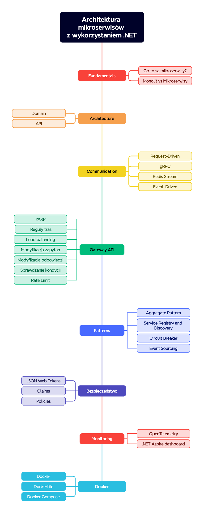

# Przykłady ze szkolenia

## Wprowadzenie

Witaj w repozytorium z materiałami do szkolenia **Architektura mikroserwisów z wykorzystaniem .NET**.

Do rozpoczęcia tego kursu potrzebujesz następujących rzeczy:

1. [.NET 9 SDK](https://dotnet.microsoft.com/en-us/download/dotnet/9.0)
2. [Docker](https://www.docker.com/products/docker-desktop/)

## Przygotowanie
1. Sklonuj repozytorium Git
```
git clone https://github.com/sulmar/sages-dotnet-microservices-...
```
2. Zbuduj
```
cd src
dotnet build
```

## Mapa drogowa


## Porty mikroserwisów

| Serwis | Port HTTPS | Port HTTP | Uwagi |
|--------|------------|-----------|-------|
| **Blazor.Client** | 7000 | 5265 | Aplikacja kliencka |
| **YarpApiGateway** | 5001 | 5129 | Brama API |
| **IdentityProvider.Api** | 7100 | 5230 | Dostawca tożsamości |
| **Dashboard.Api** | 7020 | 5250 | Mikroserwis dashboardu |
| **Document.Api** | - | - | Worker/Hosted Service (brak portu HTTP) |
| **Ordering.Api** | 7013 | 5165 | Mikroserwis zamówień |
| **Payment.Api** | 7014 | 5000 | Mikroserwis płatności (gRPC) |
| **ProductCatalog.Api** | 7011 | 7001 | Mikroserwis katalogu produktów |
| **ShoppingCart.Api** | 7012 | 5170 | Mikroserwis koszyka zakupów |

## Struktura projektów

### Clients

#### Blazor.Client
Aplikacja kliencka zbudowana w technologii Blazor WebAssembly. Zawiera:
- **Components**: Komponenty UI (Footer, Header, LoginComponent, MetricRectangle, NavBar, ProductComponent)
- **Pages**: Strony aplikacji (Dashboard, Home)
- **Model**: Modele danych (LoginModel, Product)
- **Layout**: Główny layout aplikacji (MainLayout)
- Aplikacja komunikuje się z API Gateway pod adresem `https://localhost:7011`

### ApiGateway

#### YarpApiGateway
Brama API zbudowana z wykorzystaniem YARP (Yet Another Reverse Proxy) - punkt wejścia dla wszystkich żądań klientów. Zawiera:
- Konfigurację reverse proxy z obsługą Service Discovery
- Middleware do logowania żądań i odpowiedzi
- Endpoint `/ping` do weryfikacji dostępności

### IdentityProvider
Dostawca tożsamości odpowiedzialny za autentykację i autoryzację użytkowników:
- **IdentityProvider.Api**: Warstwa API z serwisami autentykacji i autoryzacji
- **Abstractions**: Interfejsy serwisów (IAuthService, ITokenService)
- **Infrastructure**: Implementacje serwisów (AuthService, JwtTokenService)

### MicroServices

#### Dashboard
Mikroserwis dashboardu agregujący dane z różnych mikroserwisów:
- **Dashboard.Api**: Warstwa API z endpointem `/api/dashboard` agregującym dane z ProductCatalog i ShoppingCart
- **Services**: Serwisy do komunikacji z innymi mikroserwisami (ApiProductService, ApiCartService)
- **Hubs**: SignalR Hub (DashboardHub) do komunikacji w czasie rzeczywistym
- **BackgroundServices**: Tło serwisy do przetwarzania danych (DashboardBackgroundService)
- Używa Service Discovery do odnajdywania innych mikroserwisów
- Wykonuje równoległe zapytania do różnych serwisów używając `Task.WhenAll`

#### Document
Mikroserwis przetwarzania dokumentów zbudowany jako aplikacja Worker/Hosted Service:
- **Document.Api**: Aplikacja hostująca workerów do przetwarzania zdarzeń (Worker Service, brak portu HTTP)
- **Channels**: Kanały komunikacji asynchronicznej (OrderPlacedEventChannel) używające System.Threading.Channels
- **Workers**: Workerzy do przetwarzania zdarzeń:
  - **RedisStreamWorker**: Odbiera zdarzenia z Redis Streams (stream: `ordering:stream`, grupa: `document_group`)
  - **OrderProcessingWorker**: Przetwarza zdarzenia OrderPlaced z kanału (symuluje generowanie dokumentów PDF)
- Używa Redis Streams do odbierania zdarzeń z systemu Ordering
- Używa System.Threading.Channels do komunikacji między workerami
- Generuje unikalne identyfikatory konsumentów używając Nanoid

#### Ordering
Mikroserwis zamówień odpowiedzialny za tworzenie i przetwarzanie zamówień:
- **Ordering.Api**: Warstwa API z endpointem POST `/api/orders` do tworzenia zamówień
- **Services**: Serwisy do komunikacji z Payment (PaymentServiceImplementation) i publikowania zdarzeń (RedisProducer)
- **Protos**: Definicje protobuf dla komunikacji gRPC (payment.proto)
- Używa gRPC do komunikacji z mikroserwisem Payment
- Publikuje zdarzenia OrderPlaced do Redis Streams (`ordering:stream`) po pomyślnym przetworzeniu płatności
- Generuje unikalne identyfikatory zamówień używając Nanoid (5-znakowe ID z alfabetem alfanumerycznym)

#### Payment
Mikroserwis płatności udostępniający funkcjonalność płatności przez gRPC:
- **Payment.Api**: Serwis gRPC implementujący interfejs płatności
- **Services**: Implementacja serwisu płatności (PaymentServiceImplementation)
- **Protos**: Definicje protobuf dla komunikacji gRPC (payment.proto)
- Umożliwia weryfikację i przetwarzanie płatności dla zamówień

#### ProductCatalog
Mikroserwis katalogu produktów z architekturą warstwową:
- **ProductCatalog.Api**: Warstwa API z kontrolerami (CategoriesController, ProductsController) i endpointami (CategoriesEndpoints, ProductsEndpoints). Używa Minimal APIs i CORS dla komunikacji z aplikacją Blazor.
- **ProductCatalog.Domain**: Warstwa domenowa zawierająca:
  - **Entities**: Encje domenowe (Product, Category, BaseEntity)
  - **Abstractions**: Interfejsy repozytoriów (IProductRepository, ICategoryRepository, IEntityRepository)
- **ProductCatalog.Infrastructure**: Warstwa infrastruktury z implementacjami repozytoriów (InMemoryProductRepository, FakeCategoryRepository) oraz kontekstem danych (Context)

#### ShoppingCart
Mikroserwis koszyka zakupów z architekturą warstwową:
- **ShoppingCart.Api**: Warstwa API z endpointami do zarządzania koszykiem zakupów. Używa Redis jako magazynu danych i Service Discovery do komunikacji z Ordering API.
- **ShoppingCart.Domain**: Warstwa domenowa zawierająca:
  - **Entities**: Encje domenowe (CartItem)
  - **Abstractions**: Interfejsy repozytoriów i serwisów (ICartRepository, ICartService)
  - **CartService**: Logika biznesowa koszyka (checkout)
- **ShoppingCart.Infrastructure**: Warstwa infrastruktury z implementacją repozytorium Redis (RedisCartRepository)
- Wymaga uruchomionego serwisu Redis (port 6379)

#### Monitoring
Mikroserwis monitoringu systemu (obecnie w przygotowaniu).

#### UserProfile
Mikroserwis profilu użytkownika (obecnie w przygotowaniu).

### Shared.Models
Współdzielone modele danych używane przez różne mikroserwisy (obecnie w przygotowaniu).

## Infrastruktura

### Redis
System używa Redis do:
- Przechowywania danych koszyka zakupów (ShoppingCart.Api)
- Przesyłania zdarzeń przez Redis Streams (Ordering.Api → Document.Api)
- Stream: `ordering:stream`
- Consumer Group: `document_group`

### Docker Compose
Projekt zawiera konfigurację Docker Compose (`docker-compose.yml`) z następującymi serwisami:
- **shopper-redis**: Kontener Redis (port 6379)
- **productcatalog.api**: Mikroserwis katalogu produktów
- **shoppingcart.api**: Mikroserwis koszyka zakupów (zależny od Redis)
- **payment.api**: Mikroserwis płatności
- **ordering.api**: Mikroserwis zamówień

## Komunikacja między mikroserwisami

- **HTTP/REST**: Komunikacja między większością mikroserwisów (ProductCatalog, ShoppingCart, Dashboard, Ordering)
- **gRPC**: Komunikacja między Ordering.Api a Payment.Api
- **Redis Streams**: Asynchroniczna komunikacja zdarzeń między Ordering.Api a Document.Api
- **SignalR**: Komunikacja w czasie rzeczywistym w Dashboard.Api
- **System.Threading.Channels**: Komunikacja wewnętrzna w Document.Api między workerami
